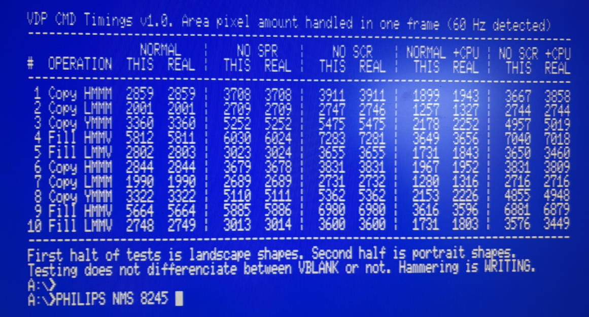

# vdpcmd | Measure V9938/V9958 command performance on the MSX

Compare your current VDP's command engine performance with real life / target numbers, using this simple __msx dos__ application. Download [here](https://github.com/bengalack/vdpcmd/raw/refs/heads/main/dska/vdpcmd.com).

## What it does
It measures the amount of pixels which the command engine is able to "produce" in one full frame, in the current set screen frequency.

The current test runs a certain operation on a rectangle of size 256x40 = 10240 pixels in screen 8. This is too much for the command engine in one frame. But we abort the command at this point, and count the amount of pixels it managed to "produce".

We run 5 tests in both landscape and in portrait (10 in total); COPY `HMMM, LMMM, YMMM` and FILLRECT `HMMV, LMMV`.

The above are run under these conditions:
1. Normal\*
2. Sprites off
3. Screen off
4. Normal and VDP is hammered\*\*
5. Screen off and VDP is hammered

\*(sprites and screen on, the CPU is leaving the VDP alone)  
\*\*(hammered means the CPU executes continuous unrolled `OUT(98),A`)

Both 50Hz and 60Hz are supported.

### Understanding the results
Results are in columns marked `THIS` and are to be compared to `REAL` which is a target value which I have measured on real machines.

Fore real MSX results in conditions 1-3 will likely not diverge much (normal diff is 0-1, maybe a fluke up to 6). Conditions 4 and 5 are harder to get perfect timings on, and we can allow a diff up to 150 without anything being wrong.

Regardless of the actuall diffs in condition 4 and 5, the value in 4 should be quite lower than in 1, and value in 5 is assumed to be somewhat lower than in 3.

### Detail section
* If you run this on turbo R or in ("Panasonic") turbo mode, the tool jumps into Z80 3.5MHz during test.
* Current tests combines measured timings: when having the raster beam both in the VBLANK area and in the active area.
    * Values in scenario 5 being so close to scanario 4 indicates that it is likely quite different command operation performance in the two areas.
* I have tried hammering with both READ and WRITE. They seem identical in performance.
* We currently use screen 8. I have tested other screen modes too. They seem identical in performance when we measure in bytes.
* Portrait/Landscape does not matter much, but they do somewhat, and that is why they are included (but I thought the diff would be bigger).
* To understand why condition 4 and 5 is added (and why we allow bigger diffs here), we must refer to [this research](https://map.grauw.nl/articles/vdp-vram-timing/vdp-timing.html) where we see that both the VDP and the CPU is fighting over the same timeslots/timeline. Microsecond timings matter here and different hardware implementations can make a difference.
* `REAL`: The target numbers are numbers verified / taken from `SONY HB-F1XDJ (V9958), PANASONIC FS-A1ST (V9958), SANYO PHC-70FD (V9958), PANASONIC A1-WSX (V9958), PANASONIC FS-A1 (V9938)`.
* From the `PANASONIC FS-A1` (V9938) and the `PHILIPS NMS 8245` (V9938) which has 0 extra wait states, the "hammered" command costs 18 cycles, while on the others it costs 19 cycles. I can see from my numbers that this affects the amount of pixels in condition 4. The more CPU commands, the less pixels produced by command engine on COPY commands.

## Background
This tool came about in the wake of releasing [Go Figure](https://www.fabulous8bit.com/p/go-figure.html), an MSX2 game which is pushing the limits of the MSX2. The game is dependent on the VDP behaving like the real chip. We quickly found that the game's scroll did not run on emulators like WebMSX (it looks like [this](img/webmsx_bug.png). timings are [here](img/webmsx.png)) and Emulicious. And even the OCM.

## Requirements
* **Run:** MSX2 or higher, MSX-DOS
* **Build:** SDCC v4.2 or higher (tested with v4.6)